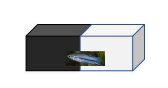
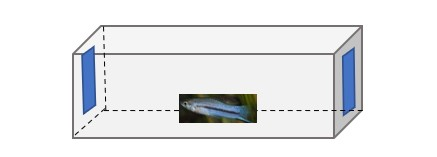
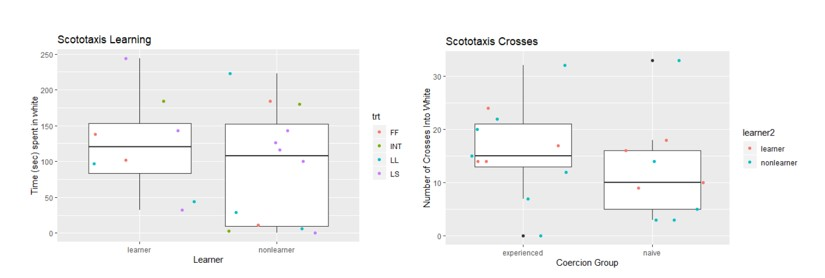
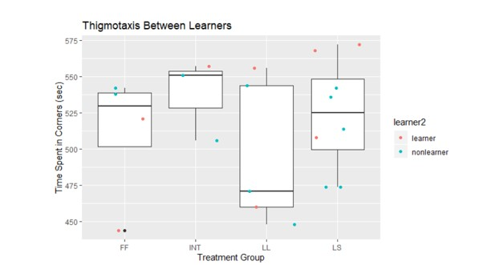
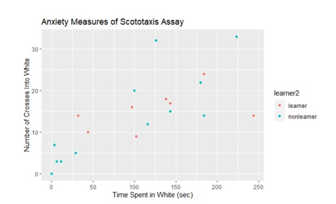
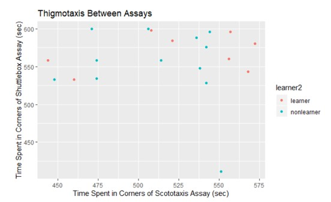

As a project for an Animal Behavior course instructed by Molly E Cummings, our team decided to investigate whether there was a correlation between boldness and the ability to learn in the fish species *Xiphophorus nigrensis*. The males of this fish species, also known as the Panuco Swordtail, have evolved different mating strategies depending on how large they are. We scored each video taken of each lone fish within a tank and performed statistical tests in RStudio. The individual report follows as well as a link to the knit PDF of the statistical analyses. 

**Measuring Learning Ability and Boldness in Female *Xiphophorus nigrensis***

By Victor Chien

**Abstract**

*Xiphophorus nigrensis* males are known to exhibit strong male-male competition for access to females by adapting different mating strategies based on their size. Since females tend to prefer large males, the reproductive strategy of large males is to court females, whereas small males will sneak copulation or coerce the females. We tested whether females who were raised in coercive experienced or coercive naïve treatment groups exhibit differences in boldness as measured by a scototaxis assay and in their ability to learn as measured by a shuttlebox assay. We then examined whether there was a relation between boldness and learning and concluded that several measures of boldness were not significant predictors of a female fish’s ability to learn nor were there significant differences between treatment groups. Since scototaxis, the preference of dark environments, and thigmotaxis, the preference of corners of the fish tank, are appropriate indexes of boldness as used in prior studies, these results suggest that a female X. nigrensis’ rearing environment does not account for their behavior in the measures of boldness nor does it account for their ability to learn or lack thereof. However, future improvements to behavioral models may suggest otherwise.

**Introduction**

Fish have historically been used to model complex systems across multiple scientific disciplines including behavioral neuroscience (Levin and Cerutti, 2009), similar to their mammalian counterparts, rats and mice. As the common ancestor of tetrapods, fish provide a simplified way to study the structure and function of vertebrate cognition as well as the neurobehavioral effects of independent evolution (Bshary and Brown, 2014). Zebrafish, in particular, have been used in substantial behavioral laboratory studies because they display the ability to learn in a range of different assays (Levin and Cerutti, 2009). As an adaptive behavior, fish tend to stay close to one another and are interested in images of other fish. The shuttlebox assay utilizes this bias by presenting computerized images of fish on a presentation screen on either side of an experimental fish in a tank as outlined in a study on zebrafish (Pather and Gerlai, 2009). Recent research has identified several anxiety indices including scototaxis, thigmotaxis, freezing, leaping out of the tank, erratic swimming, shoaling, etc. (Maximino, et al., 2010).  

In this experiment, we study the behavior of the Panuco swordtail, *Xiphophorus nigrensis* of the family poecilid. Over three decades ago, Ryan and Causey (1989) found that male X. nigrensis have different mating strategies based on their size. The phenotypic differences can be attributed to certain genetic polymorphisms (Ryan, et al., 1990). X. nigrensis females have been shown to prefer larger males, which is likely a result of genetic expression of two genes positively correlated with female bias neuroserpin and erg-1 (Cummings, et al., 2008). As a result, small males chase females to force copulation while large males court females with intermediate sized males exhibiting both behaviors. However, it is interesting to note that other species with female bias, namely G. affinis, do not necessarily exhibit males with both courting and coercive behavior (Wang, Ramsey, Cummings, 2014). X. nigrensis females grown in 5 different rearing environments surrounded by males of both coercive and courting type were tested for boldness using the scototaxis assay and the shuttlebox assay. Our primary goal was to look for a correlation between female fish’s performance in one assay with their performance in the other (i.e. are bolder fish better at learning) under the null hypothesis that boldness does not predict a female fish’s ability to learn. We hypothesize that fish that are bolder in the scototaxis assay will learn in the shuttlebox assay. Additionally, we predict that the female fish raised with courting males will be more bold, thus better learners, and that those raised with coercive males will be less bold, thus worse learners. Should our results show otherwise, there should be no difference in means between rearing groups. 

**Materials and Methods**

**Rearing Environment**

X. nigrensis females were raised in 5 different rearing/treatment groups. Environments with only large males (LL), large and small males (LS), only small males (SS), intermediately sized males (INT), and only females as a control (FF) were tested. Once each female reached maturity, they were subjected to the scototaxis assay and the shuttlebox assay. During statistical analyses, we make the distinction between coercive naïve fish (females reared in LL and FF treatment groups) and coercive experienced fish (females reared in LS, SS, INT treatment groups. 

**Scototaxis Assay**

The scototaxis assay consisted of a regularly sized fish tank with half of the area painted black and the other half white as depicted in figure 1. Since fish naturally tend to stay in the dark part of the tank to avoid predation, the scototaxis assay is a good way to measure anxious behavior and has been used in other studies by pharmacologists, toxicologists, and geneticists for different purposes (Maximino, et al., 2010). We measured the time each fish spent in the white part of the tank, the time spent in the corners and edges of the tank (thigmotaxis), and the number of times a fish crossed into the white part of the tank. The number of crosses into white and time spent in white may seem redundant at first glance, however, it is possible for one fish to spend a lot of time in white and cross only once, and another to spend an equal amount of time in white, but cross back and forth multiple times. The fish were allowed to swim freely and were scored for 10 minutes. 

Figure 1. Scototaxis assay. The fish is placed in the middle before the timer begins and barriers are removed.

**Shuttlebox Assay**

The shuttlebox assay is a temporal-spatial associative learning assay in which each fish is provided a reward (a 20 second video of a live shoal group consisting of 5 conspecific females swimming together) in 90 second time intervals at alternating ends of the tank as shown in figure 2. Once the shoal group video had played for 20 seconds at one end of the tank, 90 seconds of blank screens on both ends followed before another 20 seconds of video on the other end of the tank. This alternating pattern continued for 30 minutes, during which we evaluated whether a fish “learned” and measured boldness via time in the corners (thigmotaxis). If the fish was present in front of the “correct” screen before the 20 second reward video turned on for two consecutive intervals, she was designated a “shuttlebox learner,” otherwise, she was a non-learner. Thigmotaxis was only scored for 10 minutes after the barriers were removed. 

Figure 2. Shuttlebox assay with screens (in blue) on both ends of the tank.

**Results**

Unfortunately, after scoring each video, NAs were removed for videos that were absent from the video dataset, reducing the final dataset from n=38 to n=20. All statistical analyses were performed in RStudio. An initial Multivariate Analysis of Variance (MANOVA) was run to determine whether there was a difference in means of all numeric variables measured between learners and non-learners as well as between coercive naïve and coercive experienced. Between learners and non-learners, we found no significant difference in any variable between these two groups (F = 0.37194, P = 0.825) suggesting that learners are not necessarily bolder. We also found no significant difference in any variable between coercive naïve and coercive experienced (F = 0.65741, P = 0.6309). This suggests that rearing environment with or without coercive males does not make a female more or less bold. Figure 3 reveals no difference in means for variables between learners vs. non-learners and coercive naïve and coercive experienced. Only the response variable that explained the variance between groups the most is shown.

Figure 3. The comparison between learners and non-learners on left and coercive experienced and coercive naïve on right. Each point represents a different female fish and is color coded accordingly.

Then, an ANOVA was run to determine differences in each single variable between the four different treatment/rearing groups we had full data from. Figure 4 shows the mean time spent in corners (thigmotaxis) measured within the scototaxis assay. The graph below only displays the variable with the largest difference between groups (F = 0.767, P = 0.529), however separate ANOVAs were run between each measure of anxiety to reveal whether a fish’s rearing group influenced its level of anxiety. Alas, none were significant indicating that variations in boldness cannot be explained by rearing environment.

Figure 4. Thigmotaxis Between Learners. Mean time spent in corners of the scototaxis assay for each treatment group. Individual points for each female are shown and colored by learner and non-learner.

Although we have revealed no significant correlation between boldness and learning, we did come across a significant correlation between the time spent in white in the scototaxis assay and the number of crosses into white of the same assay portrayed in figure 5 (r = 0.7286, p = 0.0003). This suggests that fish who spend more time in the white travel back and forth between light and dark zones as opposed to crossing into white once and staying there for a long period of time. 

Figure 5. Number of crosses into white is positively correlated with time spent in white.
On the other hand, we measured thigmotaxis in both assays and interestingly, found absolutely no correlation (r = -0.0096, p = 0.968). See figure 6 below.

Figure 6. Although both axes are measures of thigmotaxis, there appears to be no overall pattern or correlation between assays.

**Discussion**

It is important to acknowledge that after removing almost half of the fish in our dataset, the remaining sample size was rather small and therefore had reduced statistical significance – especially when comparing boldness indices between the multiple treatment groups. To alleviate the issue with small sample size, randomization t-tests were performed to create a new null distribution but were ultimately not significant. However, since we had taken a measure of learning and boldness (thigmotaxis) from the shuttlebox assay alone, we decided to run two sample t-tests on just the shuttlebox dataset (n=36). Once again, there was no significant result. Since a sample size of 36 is larger and much more powerful than that of 20 and there was still no significance, this begs the question of whether thigmotaxis is even a good measure of boldness in the shuttlebox assay. For example, a fish may be inclined to stay close to the corners of the shuttlebox tank because the reward presentation screens lie on either end. Even if a fish is theoretically bolder and swims to the other side via the middle of the tank instead of the sides of the tank, it would only be swimming away from the edges for a few seconds. 

Furthermore, we may have generalized “learning” before running any statistical analyses by allocating 1 for learner and 0 for non-learner. By attributing a binary variable, we lose some degree of resolution. Prior shuttlebox research done on Zebrafish reveals that fish tend to spend less time on the side where the shoal group was just presented as time goes on if the stimulus is presented on alternating sides (Pather and Gerlai, 2008). A continuous numeric variable, such as one used in Pather and Gerlai’s article, measuring the time it takes for each female fish to learn the pattern would provide more resolution, revealing trends we are not able to see with a binary variable. Additionally, we could have differentiated between thigmotaxis in the dark and thigmotaxis in the light areas to increase resolution in the scototaxis assay.

As for the scototaxis assay, from figure 3 above, we can see a clump of non-learners who spent little time in white and crossed over infrequently. These fish may have been deemed non-learners because they failed to move and explore the tanks in either assay. We do not know the degree to which they are non-learners because learning was a binary variable. It is possible that these fish were less active and exhibited other anxious behaviors such as freezing, which may be a result of stressful manipulation (Maximino, et al., 2010). However, a fish could also show reduced exploratory behavior if it is looking at its own reflection. Since all our fish spent a majority of the time in thigmotaxis, care should be taken to ensure that the tank itself is made of matte acrylic to avoid reflective surfaces in future studies. 

We have shown that boldness does not necessarily predict learning in X. nigrensis. However, this conclusion should not be applied to all other species. Since other species may have evolved different neurobiological pathways (Gould and Gottesman, 2005), we can only apply our results to X. nigrensis and to other animals only if they have similar cognitive structures and biological pathways. For example, although similar species of fish tend to prefer dark areas, they may prefer the dark with different intensities (Maximino, et al., 2010). We did not find an association between boldness and learning likely due to our small sample size or because there is in fact no association. If this is the case, then the biological pathways for boldness and learning are separate and unique. However, it could also be the case that there is some other genetic variable that explains learning and anti-anxiety behavior that our model does not replicate appropriately. The literature has already established that female mate choice involves genes associated with learning and social cognition (Cummings, 2015), so it should be the case that rearing group affects how a female learns. The shuttlebox may simply not have revealed this to us. Indeed, we should be identifying in which specific contexts rearing group influences a female’s learning and develop an efficient assay to test this as well as predicting how a female’s early social experiences influence her boldness, anxiety, and activity levels in future experiments. Despite being unable to reveal a significant correlation between boldness and learning, the neuropsychological underpinnings of fish cognition and behavior remains a topic for further investigation.
 
 

**References**

Bshary, R., & Brown, C. (2014). Fish cognition. Current Biology, 24(19), R947–R950. doi: 10.1016/j.cub.2014.08.043

Cummings, M. E. (2015). The mate choice mind: studying mate preference, aversion and social cognition in the female poeciliid brain. Animal Behaviour, 103, 249–258. doi: 10.1016/j.anbehav.2015.02.021

Cummings, M. E., & Gelineau-kattner, R. (2009). The energetic costs of alternative male reproductive strategies in *Xiphophorus nigrensis*. Journal of Comparative Physiology, 195(10), 935-46. doi:http://dx.doi.org.ezproxy.lib.utexas.edu/10.1007/s00359-009-0469-9

Gould, T. D., & Gottesman, I. I. (2006). Psychiatric endophenotypes and the development of valid animal models. Genes, Brain and Behavior, 5(2), 113–119. doi: 10.1111/j.1601-183x.2005.00186.x

Levin ED, Cerutti DT. Behavioral Neuroscience of Zebrafish. In: Buccafusco JJ, editor. Methods of Behavior Analysis in Neuroscience. 2nd edition. Boca Raton (FL): CRC Press/Taylor & Francis; 2009. Chapter 15. Available from: https://www.ncbi.nlm.nih.gov/books/NBK5216/

Maximino, C., Brito, T. M. D., Colmanetti, R., Pontes, A. A. A., Castro, H. M. D., Lacerda, R. I. T. D., … Gouveia, A. (2010). Parametric analyses of anxiety in zebrafish scototaxis. Behavioural Brain Research, 210(1), 1–7. doi: 10.1016/j.bbr.2010.01.031

Maximino, C., Marques de Brito, T., Dias, C. et al. Scototaxis as anxiety-like behavior in fish. Nat Protoc 5, 209–216 (2010). https://doi-org.ezproxy.lib.utexas.edu/10.1038/nprot.2009.225

Pather, S., & Gerlai, R. (2009). Shuttle box learning in zebrafish (Danio rerio). Behavioural brain research, 196(2), 323–327. https://doi.org/10.1016/j.bbr.2008.09.013

Ryan, M. J., and B. J. Causey. 1989. "Alternative" mating behavior in the swordtails *Xiphophorus nigrensis* and Xiphophorus pygmaeus. Behavioral Ecology and Sociobiology 24:341-348.

Wang, S.M.T., Ramsey, M.E. and Cummings, M.E. (2014), Plasticity of the mate choice mind: courtship evokes choice‐like brain responses in females from a coercive mating system. Genes, Brain and Behavior, 13: 365-375. doi:10.1111/gbb.12124

