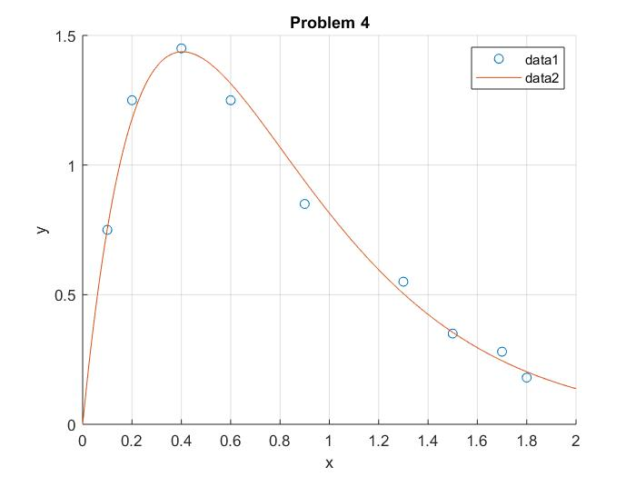
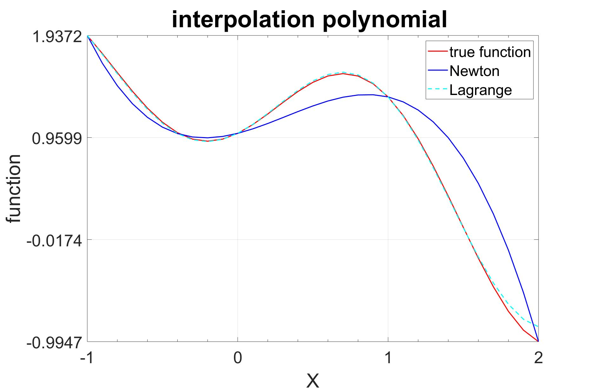
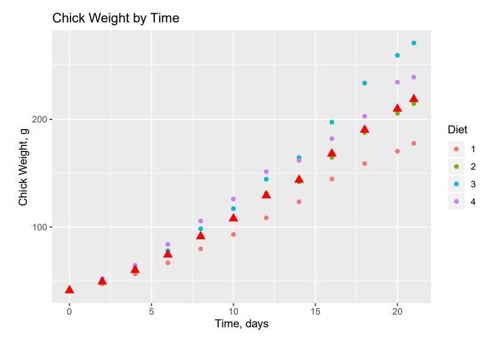
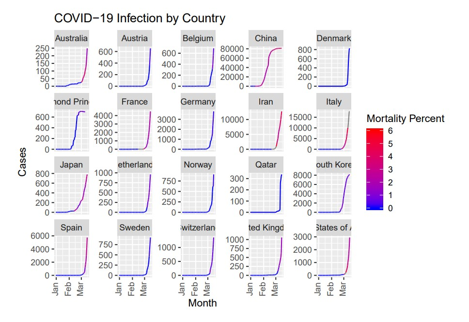
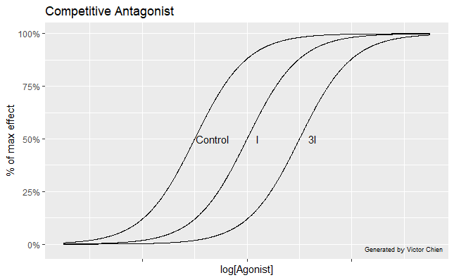
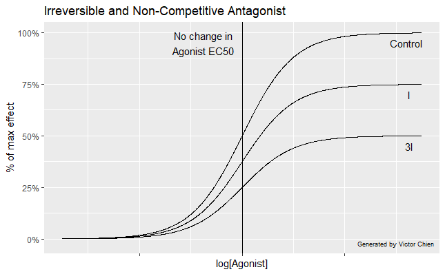

**MATLAB**

I began my adventure into the big world of data using MATLAB, believe it or not, in a series of computational engineering courses. This was my gateway to applying and understanding the fundamentals of calculus on a higher level, using my own code to solve mathematical problems such as root-finding, regression, interpolation, and linear algebra, computationally. 

 

**Computational Bio in RStudio**

Although MATLAB is a powerful tool for solving mathematical models, I eventually transitioned towards the statistical analysis techniques in RStudio. As a scientist interested in conducting more biologically- relevant research, I’ve found R to be an indispensable tool in verifying statistical significance. The ‘tidyverse’ library is excellent for cleaning, visualizing, and analyzing large datasets. 

Visualization of the means of chick weight for groups of chicks on different diets from the ChickWeight dataset in R. 

An independent project I worked on involved preliminary data analysis of COVID-19 datasets comparing factors such as wealth, air quality, and population demographics, with outbreak severity by country around the start of the pandemic. The aggregation of data from across the world onto freely-available websites provides us with information critical in ending the pandemic.

Total number of cases vs. time by country. The percent mortality is indicated by the color of the line. Note: this graphic only shows data up to the middle of March.

**Pharmacology**

I've also used R in my Principles of Drug Action class to correct a mistake in a figure of the textbook. Specifically, the mistake was in the dose-response curve of a drug in the presence of a competitive, non-competitive, and irreversible antagonist. 

Pictured above are three dose-response curves, each with different amounts of competitive inhibitor (control, I, 3I). The dose of a drug or agonist is shown on the x-axis on a log-scale and the response is shown on the y-axis as a percentage of the maximum possible effect. Since a competitive inhibitor binds to the same active site as the agonist (they compete for the same spot) the maximum possible effect does not change. If the drug receptors were saturated with agonist, they would eventually kick off all the inhibitor molecules and achieve the maximal effect. However, in the presence of more inhibitor molecules, one would require more agonist molecules, thus the curves shift to the right.

In pharmacology, the EC50 is an appropriate metric for dose-response curves. It can be defined as the concentration of agonist (x-axis as pictured above) required to obtain 50% of the drug's effect. Therefore, as the concentration of inhibitor molecules increases, the EC50 increases.

The story changes with a non-competitive antagonist. In this case, the inhibitor molecule binds to an allosteric site (different from that of the drug or agonist). This means that even if an agonist binds to a receptor that is also bound to a non-competitive antagonist, there is no way for the agonist to overcome the inhibitory effect and elicit a response. So, in terms of the dose response curve, the maximum possible effect decreases. 

Many pharmacology textbooks and resources **incorrectly** show in their figures that EC50 also changes, however, this is not the case since the *concentration* at which 50% of the maximum possible effect is achieved remains the same for each case. As it turns out, antagonists that bind irreversibly to the receptors have a similar effect on the dose-response curve.

The professor made it a point to emphasize that the textbook figure was incorrect, so I presented this new figure to him. I found that creating these graphs using the ggplot2 package helped me understand this important pharmacology concept and gave me an opportunity to brush up on my plot-making skills in R.

**Building Websites**

Aside from generating graphs, this website was actually made in RStudio! After selecting an appropriate academic theme from Hugo's wide selection, I customized my website directory locally in RStudio. I'm eager to continue exploring the possibilities when I have more free time. Once I linked the appropriate resume and links, wrote a little bit about myself, and added photos to the right folders, I pushed the website directory from my local repository onto a gihub repository. Once it was on there, I used Netlify to host my website so that anyone with an internet connection can quickly view it and learn more about me.

If you're interested in creating your own personal website, you can find themes and instructions on the Hugo website here: https://gohugo.io/
