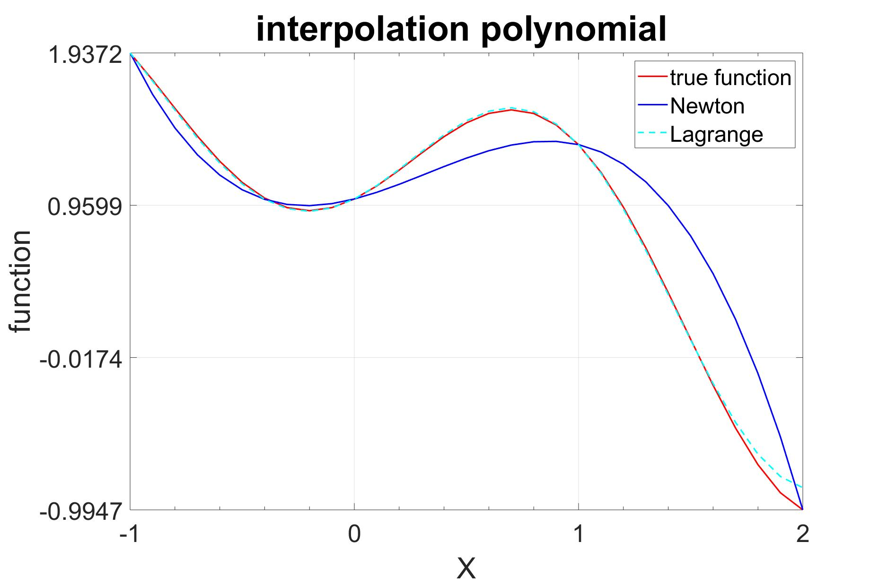

I began my adventure into the big world of data using MATLAB, believe it or not, in a series of computational engineering courses. This was my gateway to applying and understanding the fundamentals of calculus on a higher level, using my own code to solve mathematical problems such as root-finding, regression, interpolation, and linear algebra, computationally. 

 

Although MATLAB is a powerful tool for solving mathematical models, I eventually transitioned towards the statistical analysis techniques in RStudio. As a scientist interested in conducting more biologically- relevant research, I’ve found R to be an indispensable tool in verifying statistical significance. The ‘tidyverse’ library is excellent for cleaning, visualizing, and analyzing large datasets. 

Visualization of the means of chick weight for groups of chicks on different diets from the ChickWeight dataset in R. 

An independent project I worked on involved preliminary data analysis of COVID-19 datasets comparing factors such as wealth, air quality, and population demographics, with outbreak severity by country around the start of the pandemic. The aggregation of data from across the world onto freely-available websites provides us with information critical in ending the pandemic.

Total number of cases vs. time by country. The percent mortality is indicated by the color of the line. Note: this graphic only shows data up to the middle of March.
